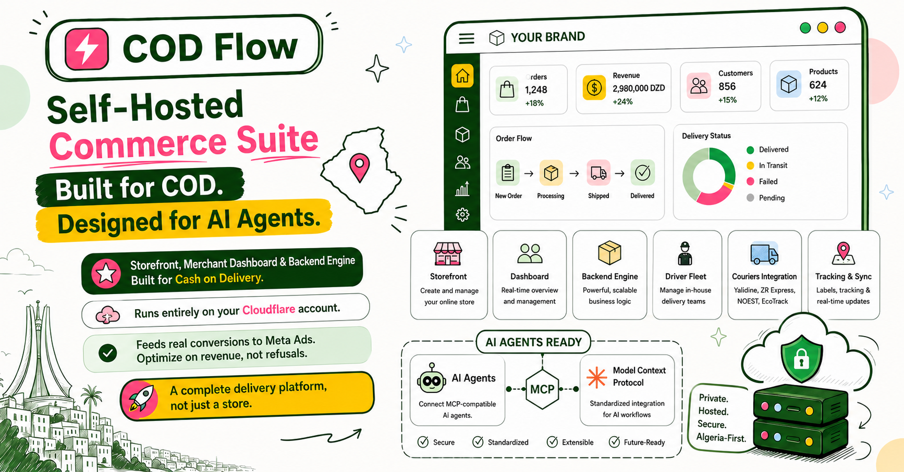
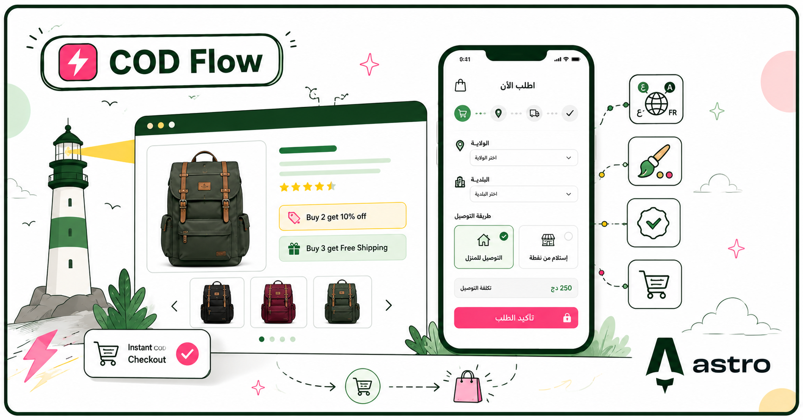
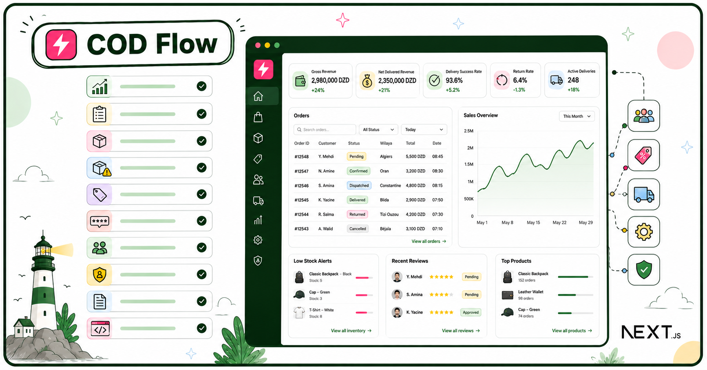
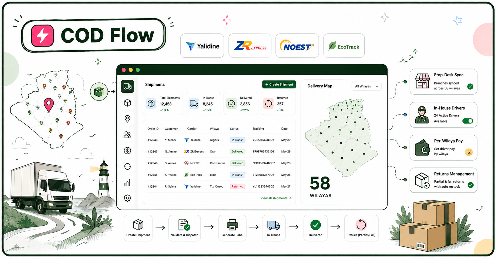
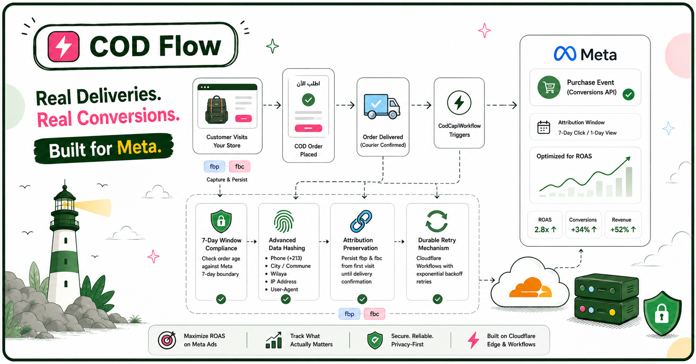
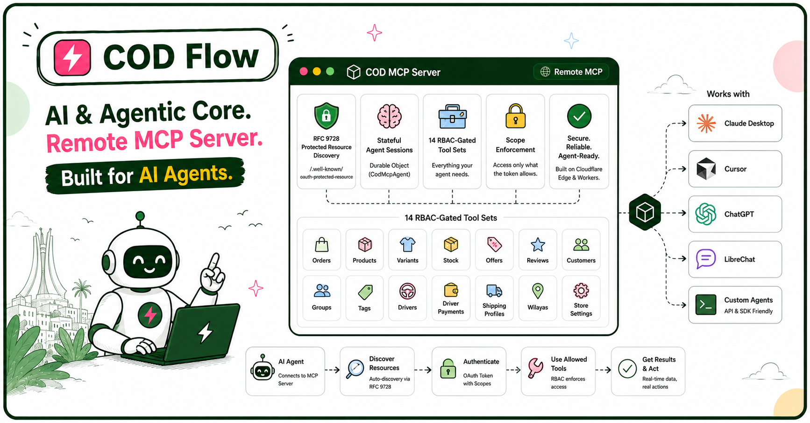

# CodFlow



> **v0.1.0** — CodFlow is released and production-ready for self-hosting. See [`CHANGELOG.md`](./CHANGELOG.md) for the release history.

**The open-source, COD-first e-commerce + delivery platform for Algeria — built agentic-ready.**

CodFlow is a self-hosted commerce engine, merchant dashboard, and high-performance storefront designed specifically for the realities of **Cash on Delivery** (COD) in Algeria and emerging markets. It runs entirely on your own Cloudflare serverless account (Workers + D1 + R2 + KV) with **zero transaction fees**, connects to Algeria's major delivery carriers, and feeds **actual cash deliveries** back to Meta Ads so your ad algorithms stop burning budget on door refusals.

```
┌────────────────────────────────────────────────────────────────────────────┐
│                                                                            │
│  COD-FIRST  •  DELIVERY ENGINE  •  AGENTIC (MCP)  •  EDGE NATIVE  •  OPEN  │
│                                                                            │
└────────────────────────────────────────────────────────────────────────────┘
```

---

## Contents

- [The COD Problem in Algeria](#the-cod-problem-in-algeria)
- [Why CodFlow](#why-codflow)
- [Feature Matrix](#feature-matrix)
  - [High-Converting Storefront (`cod-astro`)](#1-high-converting-storefront-cod-astro)
  - [Merchant Control Dashboard (`cod-client`)](#2-merchant-control-dashboard-cod-client)
  - [Logistics & 58-Wilaya Delivery Engine](#3-logistics--58-wilaya-delivery-engine)
  - [Conversion & Growth Engine (Real-Delivery Meta CAPI)](#4-conversion--growth-engine-real-delivery-meta-capi)
  - [AI & Agentic Core (Remote MCP Server)](#5-ai--agentic-core-remote-mcp-server)
  - [Engine & API (`cod-server` + `cod-shared`)](#6-engine--api-cod-server--cod-shared)
- [Architecture](#architecture)
- [Tech Stack](#tech-stack)
- [Getting Started (Local Development)](#getting-started-local-development)
- [Deploying to Production (Cloudflare)](#deploying-to-production-cloudflare)
- [Testing & Quality](#testing--quality)
- [Documentation & Resources](#documentation--resources)
- [Contributing](#contributing)
- [License](#license)

---

## The COD Problem in Algeria

E-commerce in Algeria is **95%+ Cash on Delivery (الدفع عند الاستلام)**. Western platforms like Shopify and WooCommerce were architected around credit cards, instant checkout capture, and global postal services. Forcing them onto Algerian COD creates four critical pain points:

| The Algerian COD Reality | What Traditional Platforms Do | What CodFlow Does |
| :--- | :--- | :--- |
| **30%–50% Return Rate**<br>Customers order on impulse and refuse at the door. | Fires a `Purchase` pixel event on **form submission**, training Meta ads to find more people who submit forms and refuse at the door. | Uses Cloudflare Workflows to fire Meta CAPI `Purchase` events **only when courier confirms `delivered` and cash is collected**. |
| **Courier Fragmentation**<br>Yalidine, ZR Express, NOEST, EcoTrack, plus local drivers. | Merchants juggle 5 carrier portals, manually export CSVs, copy tracking numbers, and guess stop-desk codes. | **Unified carrier layer**: one API to create shipments, print labels, sync 58-wilaya stop desks, and receive live webhook tracking. |
| **In-House Driver Fleet**<br>Merchants employ local *livreurs* for fast metro delivery. | No native driver dispatching, per-wilaya compensation tracking, or cash remittance ledger. | Built-in driver management with per-wilaya pay rates, order dispatching, and cash collection settlement. |
| **Cost & Data Lock-In**<br>Expensive monthly SaaS fees + 2% per-order tax + paid plugins. | Adds recurring overhead on thin retail margins with closed databases. | **100% Free & Open Source (Apache-2.0)**. Deploy serverless to your Cloudflare account ($0–$5/mo total hosting). |

---

## Why CodFlow

CodFlow was built from the ground up to solve the real bottlenecks of running an e-commerce business in Algeria:

### 1. Meta Ads Optimized for Cash, Not Ghost Orders
Standard pixel tracking treats an order submission as a completed sale. In COD, an order submission is only an inquiry until cash changes hands at the doorstep. CodFlow's background `CodCapiWorkflow` tracks orders through their lifecycle and fires the **Meta Conversions API (CAPI) `Purchase` event exclusively upon successful delivery**. Your ad campaigns automatically optimize for high-intent buyers with high delivery confirmation rates.

### 2. Complete 58-Wilaya Logistics Built In
From Algiers to Tamanrasset, CodFlow ships with the full Algerian geographic registry (58 wilayas and 1,541 communes). Configure flexible **Shipping Profiles** with distinct rates for **Home Delivery (à domicile)** and **Stop-Desk Pickup (bureau)** per wilaya, automatically calculate shipping in real-time on the storefront, and sync pickup centers from **Yalidine**, **ZR Express**, **NOEST**, and **EcoTrack**.

### 3. Sub-Second Edge Storefront
Algerian mobile shoppers frequently browse on variable mobile networks (Mobilis, Ooredoo, Djezzy). CodFlow's storefront is built on **Astro 7 SSR** running at Cloudflare's global edge network. Pages render in milliseconds, scripts are minimal, and the entire checkout funnel is a frictionless 1-page form in **Arabic (with native RTL)**, **French**, or **English**.

### 4. Agentic & AI-Native (Remote MCP Server)
CodFlow is the first e-commerce engine designed for the **Model Context Protocol (MCP)**. Connect Claude, Cursor, ChatGPT, or custom autonomous agents directly to your store via `/mcp`. Agents operate through secure, stateful Durable Objects (`CodMcpAgent`) with strict Role-Based Access Control (RBAC) to manage stock, update orders, moderate reviews, and adjust promotions.

### 5. Zero Middlemen, 100% Self-Hosted
Deploy CodFlow to your own Cloudflare account in minutes. Your customer records, financial data, and inventory live securely in Cloudflare D1 (SQLite) and R2 (image storage). No Shopify app subscription fees, no platform revenue cuts, and zero vendor lock-in.

---

## Feature Matrix

### 1. High-Converting Storefront (`cod-astro`)
*Customer-facing, edge-rendered storefront optimized for mobile conversions.*

- ✅ **Instant COD Checkout**: High-converting single-page order form with live wilaya/commune selectors and instant shipping cost calculation.
- ✅ **Dynamic Delivery Options**: Customer chooses between **Home Delivery** or carrier **Stop-Desk Pickup** with dynamic pickup point selection.
- ✅ **Volume Offers & Bundles**: Quantity-tier incentives ("Buy 2 get 10% off", "Buy 3 get Free Shipping") rendered directly in the buy box.
- ✅ **Order-Verified Product Reviews**: Customers submit star ratings and Arabic/French reviews tied to their verified order number.
- ✅ **Trilingual & RTL Native**: First-class support for **Arabic (العربية)**, **French (Français)**, and **English** with automated RTL layout flipping.
- ✅ **Swappable Theme Layer**: Change colors, typography, badges, and layout structure in `cod-astro/theme01/src/theme/` without touching engine logic.
- ✅ **Abandoned Cart Telemetry**: Silently captures contact inputs to flag abandoned checkouts for merchant recovery.



### 2. Merchant Control Dashboard (`cod-client`)
*Modern merchant admin portal built with Next.js 16 App Router.*

- ✅ **Operational Analytics**: Live metrics for gross revenue, net delivered revenue, delivery success rate, return rate, and active deliveries.
- ✅ **Order Management**: Filter, search, and update order statuses across the full COD lifecycle (`pending`, `confirmed`, `dispatched`, `delivered`, `returned`, `cancelled`).
- ✅ **Product & Variant Suite**: Multi-attribute variants (Size, Color, Pattern, SKU), pricing, cost tracking, and automated stock deduction.
- ✅ **Inventory & Stock Alerts**: Low-stock threshold alerts and inventory tracking across all product variants.
- ✅ **Promotion & Offer Engine**: Create time-bound promotional rules (Buy X Get Y, Free Shipping) linked to specific products or variants.
- ✅ **Review Moderation**: Approve, reject, or delete customer reviews with pending review badges.
- ✅ **Customer CRM**: Customer profiles, order histories, total spend metrics, customer segmentation groups, and tag labels.
- ✅ **Granular Team RBAC**: Assign fine-grained permission scopes (e.g., `orders:read`, `orders:manage`, `products:manage`, `delivery:manage`) to staff members.
- ✅ **Activity Audit Log**: Full administrative audit trail tracking every status change, price update, and deletion across the system.
- ✅ **Meta Pixel & CAPI Settings**: In-dashboard configuration for Meta Pixel ID, Access Token, test event codes, and attribution window parameters.



### 3. Logistics & 58-Wilaya Delivery Engine
*Comprehensive fulfillment engine combining 3rd-party carriers and internal drivers.*

- ✅ **4 Algerian Carrier Adapters**: Built-in integrations for **Yalidine**, **ZR Express**, **NOEST**, and **EcoTrack** behind a uniform provider interface.
- ✅ **Automated Shipment Dispatch**: Create shipments with one click, validate parcel data, and generate printable carrier PDF shipping labels.
- ✅ **Real-Time Webhook Receivers**: Inbound webhook handlers for Yalidine and ZR Express with **Svix HMAC signature verification** to automatically advance order statuses.
- ✅ **Stop-Desk Syncing**: Automated catalog syncing of carrier branches across 58 wilayas with merchant toggle overrides.
- ✅ **In-House Driver Fleet**: Manage your own local delivery drivers with vehicle details, availability toggles, and direct order assignment.
- ✅ **Per-Wilaya Driver Pay**: Configurable driver compensation tables (`driver_compensations`) with cash remittance settlement tracking.
- ✅ **Partial & Full Returns**: Log partial returns (e.g., customer keeps 1 of 2 items) with automatic inventory restock.



### 4. Conversion & Growth Engine (Real-Delivery Meta CAPI)
*Intelligent tracking engine designed to maximize ROAS on Meta ads.*

- ✅ **Delivery-Triggered CAPI**: Background `CodCapiWorkflow` initiates Meta Conversions API `Purchase` events exclusively upon courier delivery confirmation.
- ✅ **Meta 7-Day Window Compliance**: Automatically checks order age against Meta's 7-day attribution boundary.
- ✅ **Advanced Data Hashing**: Hashes customer phone (normalized to `+213`), city/commune, wilaya, IP address, and User-Agent per Meta specifications.
- ✅ **Attribution Preservation**: Captures `fbp` (browser ID) and `fbc` (click ID) on storefront entry and persists through delivery confirmation.
- ✅ **Durable Retry Mechanism**: Cloudflare Workflows provide automatic exponential backoff retries without blocking HTTP endpoints.



### 5. AI & Agentic Core (Remote MCP Server)
*First-class Model Context Protocol server enabling AI agents to operate the store.*

- ✅ **RFC 9728 Protected Resource Discovery**: Standardized `/.well-known/oauth-protected-resource` metadata endpoint for zero-config agent discovery.
- ✅ **Stateful Agent Sessions**: Durable Object backend (`CodMcpAgent`) maintaining multi-turn context for AI agents.
- ✅ **14 RBAC-Gated Tool Sets**: Tools for orders, products, variants, stock, offers, reviews, customers, groups, tags, drivers, driver payments, shipping profiles, wilayas, and store settings.
- ✅ **Scope Enforcement**: An agent only sees and executes tools permitted by its issued OAuth token scopes.
- ✅ **Compatible with Top Clients**: Plug directly into Claude Desktop, Cursor, ChatGPT, LibreChat, or custom agent scripts.



### 6. Engine & API (`cod-server` + `cod-shared`)
*Scalable edge backend with end-to-end type safety.*

- ✅ **Hono 4 on Workers**: Ultra-fast routing with sub-5ms cold starts globally.
- ✅ **Drizzle ORM + Cloudflare D1**: SQL-backed persistence with zero connection pool overhead.
- ✅ **Auto-Generated OpenAPI 3.1 Spec**: Interactive Swagger UI docs available at `/api/docs` and machine-readable JSON at `/api/openapi.json`.
- ✅ **Standardized Error Envelopes**: Uniform error format with semantic codes (`category`, `code`, `context`) across all endpoints.
- ✅ **R2 Image Bucket**: Public, edge-cached image storage for product galleries and brand assets.
- ✅ **Rate Limiting**: KV-backed sign-in and sensitive action rate limiting.

---

## Architecture

```
                         ┌──────────────────────────────────────────┐
                         │              cod-shared                  │
                         │   D1 schema • RBAC scopes • queries      │
                         └───────────────┬──────────────────────────┘
                                         │ relative imports
              ┌──────────────────────────┼──────────────────────────┐
              │                          │                          │
      ┌───────▼───────┐         ┌────────▼────────┐        ┌────────▼────────┐
      │  Storefront   │         │     Backend     │        │   Dashboard     │
      │  cod-astro    │──/store─▶  cod-server     │◀──/api─│  cod-client     │
      │  (Astro 7)    │  API    │ (Hono + Workflows) API   │  (Next.js 16)   │
      └───────┬───────┘         └───┬─────┬───────┘        └─────────────────┘
              │                     │     │
              │               /webhooks   │ CodCapiWorkflow
              │              carrier calls│
              │                     │     └─────────▶ Meta Conversions API (CAPI)
              │                     │                 (Purchase @ delivered)
              │                     │
              │              ┌──────▼──────┐
              │              │ Carriers    │   Yalidine • ZR Express  (webhooks)
              │              │  APIs       │   NOEST • EcoTrack       (tracking pull)
              │              └─────────────┘
              │
              │        /images (R2)      /mcp (AI agents, OAuth-scoped)
              └───────────────────────────────────────────────▶
```

---

## Tech Stack

| Package | Stack | Runtime Environment |
| :--- | :--- | :--- |
| **`cod-astro/theme01`** | Astro 7, Tailwind CSS v4, TypeScript | Cloudflare Workers + Static Assets |
| **`cod-server`** | Hono 4, Drizzle ORM, Zod, Better Auth, Cloudflare Agents SDK, Workflows | Cloudflare Workers, D1 (SQLite), R2, KV |
| **`cod-client`** | Next.js 16 (App Router), React 19, Tailwind v4, OpenNext | Cloudflare Workers |
| **`cod-shared`** | Drizzle ORM Schema, RBAC Scopes, Error Code Registry | Source-shared package |

---

## Getting Started (Local Development)

Run the full platform locally — storefront, merchant dashboard, and backend sharing a single local D1 database.

### ⚡ Fast Track: Setup Runbook (AI Agents & Developers)

Setup is a guided runbook — it creates the Cloudflare resources (D1, R2, KV),
binds their real IDs into the `wrangler.toml` files, migrates and seeds the
database, and verifies the deployment.

> 🤖 **Using an AI Coding Assistant?** CodFlow includes an autonomous setup skill. Tell your agent: *"Set up CodFlow"* and it will follow the [`codflow-setup` runbook](./.agents/skills/codflow-setup/SKILL.md).

---

### Manual Step-by-Step Setup

#### 0. Prerequisites
- **Node.js 22.12+** and npm
- **Wrangler CLI**: `npm install -g wrangler`
- A free **Cloudflare account** (for D1, R2, KV bindings)

#### 1. Clone & Install Dependencies

```bash
git clone https://github.com/bighadj22/codflow.git
cd codflow

# One install covers all workspaces (root package.json + single lockfile)
npm ci
```

### 2. Create Cloudflare Resources

```bash
wrangler login
wrangler d1 create codflow-db
wrangler r2 bucket create codflow-images
wrangler kv namespace create RATE_LIMIT_KV
```

### 3. Configure Local Environment Variables

Copy the example environment files in each package and populate your resource IDs:

```bash
# Backend
cd cod-server
cp .dev.vars.example .dev.vars
# Update database_id and bucket_name in wrangler.toml

# Dashboard
cd ../cod-client
cp .dev.vars.example .dev.vars
# Set BETTER_AUTH_SECRET (e.g. openssl rand -base64 32) and KV ID in wrangler.toml

# Storefront
cd ../cod-astro/theme01
cp .dev.vars.example .dev.vars
```

### 4. Apply Database Migrations & Seed

```bash
cd cod-server
npm run db:setup:local     # Applies D1 migrations and seeds sample products & wilayas
```

### 5. Create an Admin Account

```bash
cd ../cod-client
ADMIN_EMAIL=admin@example.com ADMIN_NAME=Admin node scripts/seed-admin.mjs
```
*The script outputs your generated admin password and API key.*

### 6. Start the Development Servers

Open three terminal windows (local D1 state is shared through `.wrangler-shared`):

| Package | Command | URL | Description |
| :--- | :--- | :--- | :--- |
| **Backend** | `cd cod-server && npm run dev` | `http://localhost:8787` | API & OpenAPI Docs at `/api/docs` |
| **Dashboard** | `cd cod-client && npm run dev` | `http://localhost:3000` | Merchant Admin Panel |
| **Storefront** | `cd cod-astro/theme01 && npm run dev` | `http://localhost:4321` | Customer Storefront |

---

## Deploying to Production (Cloudflare)

Deploy all three applications directly to Cloudflare Workers with zero server configuration.

### 1. Deploy the Backend (`cod-server`)

```bash
cd cod-server
npm run deploy
wrangler secret put BETTER_AUTH_SECRET
```

### 2. Deploy the Merchant Dashboard (`cod-client`)

```bash
cd ../cod-client
npm run deploy
wrangler secret put BETTER_AUTH_SECRET
```

### 3. Deploy the Storefront (`cod-astro`)

```bash
cd ../cod-astro/theme01
# Point the storefront at your deployed backend, then deploy:
#   set COD_SERVER_URL in wrangler.jsonc (e.g. https://api.yourdomain.com)
npm run deploy                                # astro build && wrangler deploy
wrangler secret put STORE_API_KEY             # same key seeded into D1 (Step 4 of setup)
```

> **Important — workers.dev limitation:** Cloudflare blocks Worker→Worker
> `fetch()` between two `*.workers.dev` hosts (error 1042). A storefront on
> workers.dev cannot load products from an API also on workers.dev.
> For a working production deployment, put at least `cod-server` on a custom
> domain/route in your Cloudflare zone and point `COD_SERVER_URL` at it
> (or wire a Service Binding between the two workers).
> Local development is unaffected (`localhost:4321 → localhost:8787`).

### 4. Configure Production URLs & Meta Pixel

1. Set `NEXT_PUBLIC_WORKER_URL` in `cod-client` to your deployed backend URL.
2. Sign into your production dashboard at `https://admin.yourdomain.com`.
3. Navigate to **Settings → Meta Pixel** and input your **Pixel ID** and **CAPI Access Token** to activate real-delivery optimization.

---

## Testing & Quality

CodFlow maintains comprehensive automated test suites covering backend handlers, OpenAPI contracts, RBAC security, and UI components:

```bash
# Run backend tests (handlers, workflows, OpenAPI schemas, MCP tools)
cd cod-server && npm test

# Run dashboard tests (actions, RBAC permissions, internationalization)
cd cod-client && npm test

# Run storefront tests (property-based and cart calculation tests)
cd cod-astro/theme01 && npm test

# Run full TypeScript verification across packages
cd cod-server && npm run typecheck
cd ../cod-client && npm run typecheck
```

---

## Documentation & Resources

- **[`CONTRIBUTING.md`](./CONTRIBUTING.md)** — Guide on development standards, PR workflows, and branch conventions.
- **[`AGENTS.md`](./AGENTS.md)** — Repository instructions and architectural rules for AI coding assistants.
- **[`codflow-setup` Skill](./.agents/skills/codflow-setup/SKILL.md)** — Autonomous setup and Cloudflare provisioning runbook for AI agents and developers.
- **[`cod-astro/theme01/THEME_GUIDE.md`](./cod-astro/theme01/THEME_GUIDE.md)** — Storefront customization and theming guide.
- **[`SECURITY.md`](./SECURITY.md)** — Security policies and vulnerability reporting procedures.
- **[`CHANGELOG.md`](./CHANGELOG.md)** — Detailed version history and upgrade notes.

---

## Contributing

We welcome contributions from developers across Algeria and the global open-source community!

1. Fork the repository and create a feature branch (`feat/amazing-feature`).
2. Adhere to code-verified claims and maintain 100% test coverage.
3. Ensure no credentials or live API keys are committed.
4. Submit a Pull Request referencing the related issue.

---

## License

CodFlow is open-source software licensed under the **Apache License 2.0**.  
See the [`LICENSE`](./LICENSE) and [`NOTICE`](./NOTICE) files for details.
